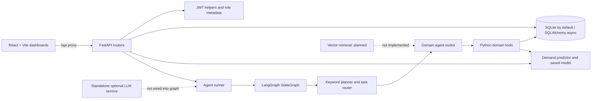
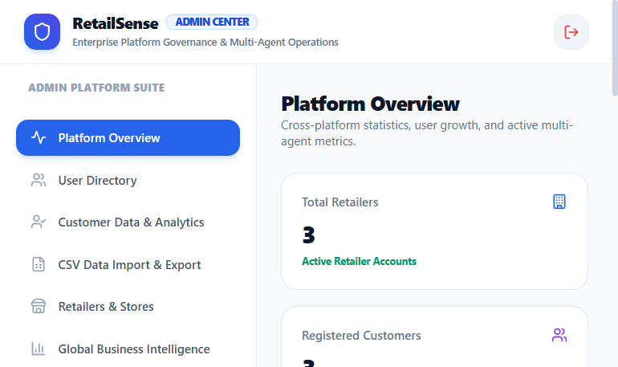
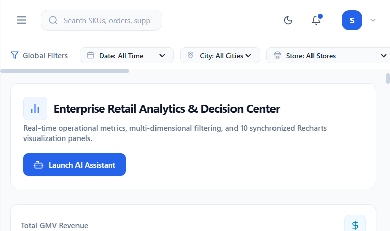

# RetailSense AI

**Multi-Agent Autonomous Retail Intelligence & Decision System**

RetailSense AI is a local-first retail analytics demo. It combines a React dashboard, FastAPI services, an async SQLAlchemy data layer, a rule-routed LangGraph workflow, and a trained demand regression model to explore inventory, purchasing, pricing, and customer scenarios.

> This repository is a portfolio/demo application, not a production-ready retail platform. The status labels below describe what the source currently does, not roadmap promises.

## Contents

- [Overview](#overview)
- [Feature Status](#feature-status)
- [Dashboards](#dashboards)
- [Architecture](#architecture)
- [Agents](#agents)
- [Technology](#technology)
- [Data and Database](#data-and-database)
- [API](#api)
- [Screenshots](#screenshots)
- [Setup](#setup)
- [Configuration](#configuration)
- [Run the Application](#run-the-application)
- [Tests](#tests)
- [Security and Limitations](#security-and-limitations)
- [Contributing, License, and Author](#contributing-license-and-author)

## Overview

Retail teams work across sales transactions, stock levels, supplier constraints, and customer orders. This project brings those datasets into one demonstrator: dashboards query a FastAPI backend, and an agent workflow combines domain tools and demand predictions into a structured recommendation.

### Feature Status

| Capability | Status | What the code currently provides |
|---|---|---|
| JWT login and password hashing | Implemented | Login, signed tokens, password hash/verify, active-user check, and role permission values |
| Three dashboard experiences | Partial | Separate Admin, Retailer, and Customer layouts; some UI panels/actions remain local demo state |
| Retail analytics and CRUD-style reads | Implemented | API-backed KPI, sales, products, orders, inventory, customer, supplier, and returns reads |
| CSV preview/import/export | Partial | Router, templates, mapping UI, and imports for selected entities; server-side validation/access control are incomplete |
| Agent orchestration | Implemented | Keyword classification, sequential task routing, tool calls, approval-state calculation, and result shaping |
| Demand forecasting | Implemented | Saved regression artifact, feature pipeline, inference endpoint, and training script |
| LLM text generation | Partial | Standalone OpenAI client with deterministic fallback; not called by the LangGraph request path |
| RAG/vector search | Planned | Package directories and document tables exist, but no implemented embedding/vector retrieval pipeline is wired into the app |
| Human approval workflow | Partial | Orchestrator calculates approval-required state; no complete persisted approval-review UI/API workflow is connected |
| Deployment and CI | Planned | Local development configuration is present; no deployment manifests or CI workflow are included |

See [the project audit](docs/PROJECT_AUDIT.md) for evidence and status details.

## Dashboards

### Admin

The Admin layout displays backend-backed overview metrics and loads users and tool-call logs. It also contains customer management and CSV views. Agent health/latency/task counts and the approval queue shown in the UI are hard-coded client-side examples; they are not live monitoring or persisted approvals. Admin API authorization needs hardening before deployment.

### Retailer

The Retailer layout includes sales/KPI, forecasting, inventory, products, orders, customer, supplier, CSV, and report views. Several screens fetch backend data. Some sidebar destinations are not wired to a rendered view, and not every visible control is backed by an API action.

### Customer

The Customer layout includes product discovery, recommendation display, order list, assistant, offers, and profile tabs. Recommendations use the `CUST_001` demo profile; cart, coupons, and checkout are client-side demonstrations and do not create persistent orders. The assistant calls the agent endpoint and uses a static response fallback.

More detail: [Dashboard guide](docs/DASHBOARDS.md).

## Architecture



The orchestration graph uses shared in-memory state and sequential task routing. Agent tool functions query the database and model; the current workflow does not persist its run state through the `agent_runs`/`tool_calls` models. See [Architecture](docs/ARCHITECTURE.md) and [Agent workflow](docs/AI_AGENT_WORKFLOW.md).

## Agents

The eight registered graph nodes are the Orchestrator, Demand Forecasting, Inventory Optimization, Procurement, Pricing & Promotion, Customer Personalization, Customer Support, and Returns Resolution agents. They are Python functions, not independently deployed services. Goal routing and most decisions are deterministic; no live autonomous LLM planning is in this graph.

See [AI agent reference](docs/AI_AGENTS.md) for responsibilities, inputs, outputs, tools, and limitations.

## Technology

| Layer | Technologies in the repository |
|---|---|
| Backend | Python, FastAPI, Pydantic, SQLAlchemy async, Uvicorn |
| Database | SQLite default through `aiosqlite`; PostgreSQL-related drivers are listed but production PostgreSQL deployment is not configured |
| Frontend | React, Vite, React Router, Tailwind CSS, Recharts, Lucide |
| Orchestration | LangGraph StateGraph when installed; a local fallback engine is defined in `agents/graph.py` |
| ML | pandas, NumPy, scikit-learn, XGBoost, joblib |
| Auth | Passlib bcrypt/bcrypt-sha256, bcrypt, python-jose JWT |
| Optional text generation | OpenAI client wrapper in `llm/`; requires an API key supplied via process environment |

Exact Python dependency declarations are in [requirements.txt](requirements.txt); frontend dependencies are in [frontend/package.json](frontend/package.json).

## Data and Database

The SQLAlchemy model module defines 19 tables: users, products, stores, sales, inventory, customers, orders, order items, suppliers, returns, promotions, agent tasks/messages/runs, tool calls, recommendations, approvals, documents, and document chunks. The default database URL creates a local `retailsense.db`; initialization uses `Base.metadata.create_all`, not an applied migration history.

Generated supporting CSVs live under `data/generated/`; processed features and transaction samples live under `data/processed/` and `data/raw/`. Confirm dataset provenance before publishing or using any non-synthetic records. Schema and relationships: [Database guide](docs/DATABASE.md) and [data dictionary](docs/DATA_DICTIONARY.md).

## API

The API is mounted under `/api/v1`; interactive OpenAPI documentation is available when the backend is running at [http://127.0.0.1:8000/docs](http://127.0.0.1:8000/docs).

| Area | Routes |
|---|---|
| Health | `GET /`, `GET /health` |
| Auth | `POST /api/v1/auth/login`, `GET /api/v1/auth/me`, `GET /api/v1/auth/roles`, `POST /api/v1/auth/users` |
| Dashboards/data | `/dashboard/kpis`, `/sales`, `/forecast/demand`, `/inventory/items`, `/products`, `/customers`, `/orders`, `/suppliers`, `/returns` |
| Admin | `/admin/stats`, `/admin/overview`, `/admin/users`, user status/role updates, `/admin/audit-logs` |
| Agents | `GET /agents/health`, `POST /agents/execute` |
| CSV | `/data/template/{entity}`, `/data/import/preview`, `/data/import/execute`, `/data/export` |

See [API guide](docs/API_GUIDE.md) for route details and known authorization gaps.

## Screenshots

These are genuine screenshots captured from the running local app using seeded demo data. The Admin agent-status and approval elements in its image are static UI examples, not live monitoring.

| View | Screenshot |
|---|---|
| Admin overview |  |
| Retailer dashboard |  |

The Swagger screenshot and the remaining capture checklist are in the [gallery](docs/SCREENSHOTS.md) and [capture guide](docs/SCREENSHOT_GUIDE.md). Customer and login captures are still pending.

## Setup

Requirements: Windows PowerShell, Python supported by the installed dependencies, and Node.js/npm. Use two VS Code terminals from the repository root.

```powershell
cd "D:\Project\RetailSense AI - Multi Agent Autonomous Retail Intelligence & Decision System"
py -m venv .venv
Set-ExecutionPolicy -Scope Process -ExecutionPolicy RemoteSigned
.\.venv\Scripts\Activate.ps1
python -m pip install --upgrade pip
python -m pip install -r requirements.txt
if (-not (Test-Path .env)) { Copy-Item .env.example .env }
```

The example is configured for local development and SQLite. Keep `.env` private; it is ignored by Git. `OPENAI_API_KEY` is optional and only used by the standalone `llm/` client, not required to run the agent graph. See [setup guide](docs/SETUP_GUIDE.md) for macOS/Linux notes and troubleshooting.

## Configuration

| Variable | Purpose | Local example |
|---|---|---|
| `APP_ENV` | Environment mode; demo user seeding is development-only | `development` |
| `DEBUG` | Development behavior | `True` |
| `SECRET_KEY` | JWT signing key; production rejects placeholders/short defaults | Placeholder only in `.env.example` |
| `DATABASE_URL` | SQLAlchemy async DB URL | `sqlite+aiosqlite:///./retailsense.db` |
| `OPENAI_API_KEY` | Optional standalone LLM client key | `your_openai_api_key_here` |

Do not place real credentials in committed files or screenshots. See [security guide](docs/SECURITY.md).

## Run the Application

**Terminal 1, backend:**

```powershell
cd "D:\Project\RetailSense AI - Multi Agent Autonomous Retail Intelligence & Decision System"
.\.venv\Scripts\Activate.ps1
python database\init_db.py
python database\seed_data.py
python -m uvicorn backend.main:app --reload --host 127.0.0.1 --port 8000
```

**Terminal 2, frontend:**

```powershell
cd "D:\Project\RetailSense AI - Multi Agent Autonomous Retail Intelligence & Decision System\frontend"
npm install
npm run dev
```

Open `http://127.0.0.1:5173/`. Vite proxies `/api` to `http://127.0.0.1:8000`. If the port is taken, stop the existing service or configure a matching Vite proxy/backend port.

Demo accounts are seeded only when `APP_ENV=development`. The login screen provides local persona shortcuts; never reuse these demo accounts in a deployed environment.

## Tests

```powershell
python -m pytest -q
```

Build the frontend:

```powershell
cd frontend
npm run build
```

There is no frontend lint script currently defined in `package.json`.

## Security and Limitations

- Several data/admin/agent routes do not enforce authenticated role dependencies; the admin and CSV endpoints must not be exposed to untrusted networks as-is.
- CORS currently permits all origins with credentials. Configure an explicit allowlist before deployment.
- CSV import does not enforce the UI's displayed 50 MB limit, validate every entity schema, or consistently apply the advertised duplicate strategies.
- The agent graph uses deterministic keyword routing and a fixed 7-day forecast path for agent forecasts; replanning includes a hard-coded demo supplier scenario.
- Approval checks produce state but do not complete a persisted approval workflow or gate a real purchase-order execution.
- `rag/` contains package placeholders; policy snippets in the orchestrator are static examples, not vector retrieval.
- Customer checkout, coupons, and some admin panels are frontend-only demonstrations.
- No deployment profile, CI workflow, or license file is present. Do not infer production readiness or a license grant.

See [security](docs/SECURITY.md), [data flow](docs/DATA_FLOW.md), and [audit](docs/PROJECT_AUDIT.md) for the full findings and proposed work.

## Contributing, License, and Author

Start with [CONTRIBUTING.md](CONTRIBUTING.md). No license file is present; repository reuse terms are therefore unspecified. The GitHub repository owner is [YuvrajPatekar0514](https://github.com/YuvrajPatekar0514).
