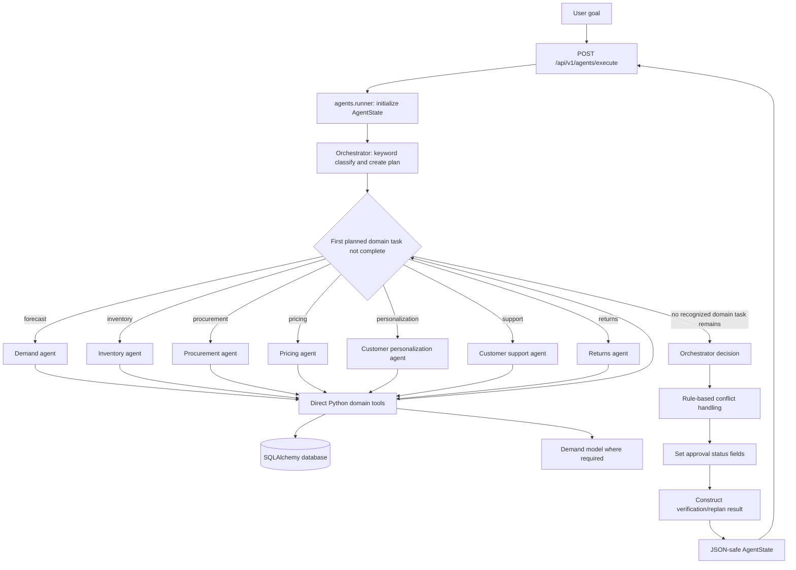

# AI Agent Workflow

## Request Lifecycle

The live request path starts at `POST /api/v1/agents/execute`. It calls `execute_agent_workflow`, creates a new in-memory state, invokes the compiled graph, and returns a JSON-safe state. Goal classification and route selection are deterministic code; the LLM client and the empty `rag/` packages are not involved.

## Routing and Shared State

`AgentState` carries the goal, user and role labels, ordered plan, completed tasks, agent/tool outputs, message list, approval fields, errors, supplier retry history, replan events, and audit-trail list. The runner initializes a fresh state for every request. There is no persistent conversational memory.

`router_node` scans the plan and routes the first unfinished domain task it recognizes. It routes `demand_forecasting`, `inventory_optimization`, `procurement_planning`, `pricing_optimization`, `customer_personalization`, `customer_support_inquiry`, and `returns_resolution`. Once none of those are pending, it sends state to `orchestrator_decision`; the decision function calls conflict resolution, approval calculation, and verification in sequence.

The plan can contain control-task names such as `conflict_resolution`, `approval_check`, and `outcome_verification`; they are handled together in the decision function rather than as independent graph nodes.

## Tool Execution and Data Sources

Agents import domain functions from `tools/`. Those functions validate some inputs with Pydantic, return dictionaries with `success`, `tool_name`, `data`, and `error`, and use repository/session helpers to query or write data. Tool invocations are not persisted by this workflow to the `AgentRun`/`ToolCall` tables.

Demand tools call the predictor and load a serialized model. Other tool families perform database reads, calculations, and (for returns) a database write. No agent uses an LLM function-call loop.

## Approval and Verification

The Orchestrator sets `approval_required=True`, `approval_status="pending"`, and `execution_allowed=False` when estimated procurement cost is above $5,000 or the simulated promotion discount is above 20%. Otherwise the status is set to approved. No connected approval API/UI action consumes the state, and no purchase order or price update is submitted by the graph. Treat this as a demo decision flag, not an operational control.

Verification records whether the current state has errors. A special hard-coded failover scenario substitutes constant supplier details; it is not a live supplier retry. Static policy excerpts are inserted into `retrieved_sources` as examples; they are not retrieved from a vector index.

## Failure Behavior and Operational Boundary

`POST /agents/execute` catches exceptions, logs them, and returns HTTP 500 with a failure detail. There is no durable job queue, run resumption, distributed agent worker, rate limit, or per-route authorization in the current agent router. Do not expose it to untrusted callers without access controls.

See [AI_AGENTS.md](AI_AGENTS.md) for each node's input, output, dependencies, and current status.
