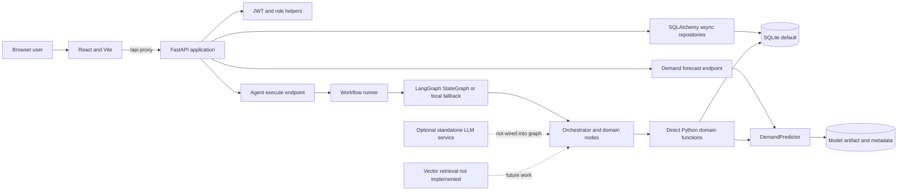
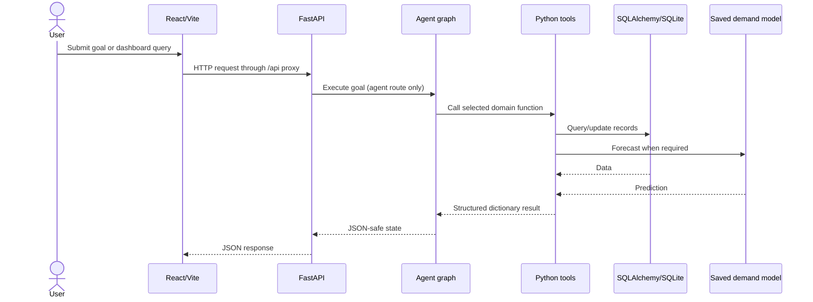

# System Architecture

RetailSense AI is a local-first application composed of a React/Vite frontend, FastAPI API, async SQLAlchemy persistence, domain tools, a deterministic multi-agent graph, and a saved demand regression model. This document describes code that is currently present; it is not a production deployment specification.

## Component Diagram



## Frontend

`frontend/src/App.jsx` provides public login and protected `/admin/*`, `/retailer/*`, and `/customer/*` layout routes. `AuthContext` stores the JWT and user object in browser `localStorage`; the API service attaches the bearer token and Vite proxies `/api` to port 8000. `ProtectedRoute` checks for a user but does not enforce role-specific access to each layout.

The Admin layout uses API calls for overview, users, and audit-list content but also contains local mock agent health and approval state. The Retailer and Customer layouts contain a mix of API-backed data and prototype-only state; see [DASHBOARDS.md](DASHBOARDS.md).

## API and Persistence

`backend/main.py` creates the FastAPI application, enables CORS, and mounts routers for auth, KPIs, sales, demand forecast, inventory, products, customers, orders, suppliers, returns, agents, admin, and CSV operations. Interactive OpenAPI docs are at `/docs`.

`database/session.py` configures `AsyncSession` and the async engine. SQLite is the default through `aiosqlite`; `DATABASE_URL` can select another SQLAlchemy async driver. Nineteen ORM models are in `database/models/models.py`. `database/init_db.py` uses `create_all`; Alembic is a dependency but the standard local startup does not run migrations.

Authentication helpers sign JWTs and verify password hashes. Role permission data is returned to the frontend and a `require_roles` dependency is used for user registration. Many other data/admin endpoints do not currently apply authentication dependencies, so this is not a complete RBAC boundary. See [SECURITY.md](SECURITY.md).

## Agent Execution

`POST /api/v1/agents/execute` enters `agents/runner.py`, which initializes a new `AgentState` and invokes the graph. `agents/graph.py` registers the Orchestrator's planner/decision functions and seven domain nodes. Keyword rules classify the goal, and `router_node` dispatches unfinished task names sequentially. Each domain node calls imported Python functions from `tools/` and stores outputs in shared state.

The Orchestrator computes conflict notes, approval flags, and verification output. Approval values are not connected to a persisted review action or a live purchase/price execution. The runner returns state as JSON-safe output but does not write each run to `agent_runs`/`tool_calls`. The graph uses no LLM-based tool calling. See [AI_AGENT_WORKFLOW.md](AI_AGENT_WORKFLOW.md).

## ML, LLM, and Retrieval

- **Demand ML:** `ml/train.py` evaluates Linear Regression, Random Forest, and XGBoost on pre-split feature data; `ml/predict.py` loads a serialized artifact. Horizon outputs apply a deterministic sinusoidal adjustment to one baseline prediction. See [DATA_FLOW.md](DATA_FLOW.md).
- **Recommendation:** `tools/customer_tools.py` filters by preferred category and applies a loyalty-tier discount; no RFM clustering implementation is wired into this path.
- **LLM:** `llm/` supplies an optional OpenAI client, prompt/service layer, and Pydantic output schemas. It is separate from the API agent graph; no provider key is needed for the graph.
- **RAG:** `rag/` package directories only contain initializers. Database document metadata models exist, but there is no embedding, vector-store, or retriever implementation. Static source snippets in the Orchestrator are not retrieval.

## Data and Workflow Diagram



## Source Map

```text
backend/main.py             FastAPI application and router registration
backend/app/api/            HTTP route modules
backend/app/core/           settings, password, JWT, and dependency helpers
agents/                     shared state, graph, runner, and specialized nodes
tools/                      direct domain functions and registry
database/models/models.py   19 SQLAlchemy tables
database/repository/        reusable data-access functions
ml/                         preprocessing, training, registry, and inference
llm/                        optional standalone generation client/service
rag/                        empty package placeholders; no live retrieval
frontend/src/               React layouts, routes, auth context, and API client
tests/                      pytest unit and integration directories
docs/                       architecture, agent, data, API, security, and setup guides
```

See [PROJECT_AUDIT.md](PROJECT_AUDIT.md) for implementation status and known gaps.