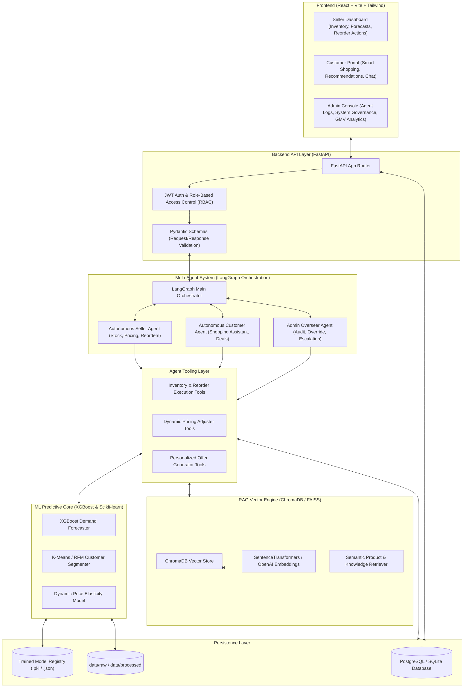

# RetailSense AI — System Architecture Specification

## 1. Executive System Overview

**RetailSense AI** is a multi-agent autonomous retail intelligence and decision platform designed for modern e-commerce and omnichannel retail operations. It combines:

1. **Agentic AI & Multi-Agent Orchestration**: LangGraph state machines governing autonomous agent teams (Seller Agent, Customer Agent, Admin Overseer Agent).
2. **Machine Learning Predictive Suite**: XGBoost demand forecasting, Scikit-learn customer RFM segmentation, dynamic elasticity pricing models.
3. **Generative AI & RAG**: Semantic vector retrieval using ChromaDB/FAISS for product catalog exploration, policy querying, and context-aware natural language interactions.
4. **FastAPI Backend & Async Database Architecture**: Production-grade async FastAPI backend, PostgreSQL-ready SQLAlchemy ORM models, Alembic migrations, and Pydantic v2 schemas.
5. **Modern React Frontend**: Vite + React + Tailwind CSS dashboard providing intuitive, real-time control panels for Sellers, Customers, and System Administrators.

---

## 2. High-Level Architecture Diagram



---

## 3. Directory Layout & Repository Structure

```
RetailSense AI/
├── frontend/                     # React + Vite + Tailwind CSS User Interface
│   ├── src/
│   │   ├── components/           # Reusable UI components (Tables, Charts, Modals)
│   │   ├── pages/                # Seller, Customer, and Admin View Views
│   │   ├── hooks/                # Custom React hooks (useAuth, useAgents, useForecasts)
│   │   ├── services/             # Axios / Fetch API client functions
│   │   └── context/              # React Context for State Management
│   ├── package.json
│   └── vite.config.js
│
├── backend/                      # FastAPI Python Web Backend
│   ├── app/
│   │   ├── api/                  # API Endpoint Routers (v1)
│   │   │   ├── seller.py         # Inventory, reorders, forecasting APIs
│   │   │   ├── customer.py       # Recommendation, cart, chat APIs
│   │   │   ├── admin.py          # System audit, logs, GMV metrics
│   │   │   └── auth.py           # User authentication & token management
│   │   ├── core/                 # Core configs, security, DB connections
│   │   ├── models/               # SQLAlchemy ORM Models (PostgreSQL ready)
│   │   └── schemas/              # Pydantic Schemas for Validation
│   └── main.py                   # FastAPI Application Entrypoint
│
├── agents/                       # LangGraph Multi-Agent System
│   ├── orchestrator/             # State graph orchestrator & router
│   ├── seller/                   # Seller Inventory & Pricing Agent
│   ├── customer/                 # Customer Shopping Assistant Agent
│   ├── admin/                    # System Overseer Agent
│   └── state.py                  # Agent State definitions (TypedDict / Pydantic)
│
├── ml/                           # Machine Learning Pipelines & Training Code
│   ├── forecasting/              # Time-series Demand Forecasting (XGBoost)
│   ├── segmentation/             # Customer RFM Clustering (Scikit-learn)
│   ├── recommendation/           # Collaborative / Content Filtering
│   ├── pricing/                  # Price Elasticity & Dynamic Markdown
│   └── pipeline.py               # Data ingestion, transformation, & training pipeline
│
├── rag/                          # Retrieval-Augmented Generation Engine
│   ├── vectorstore/              # ChromaDB / FAISS client setup & collections
│   ├── embeddings/               # Text embedding generators
│   └── retriever/                # Semantic query retriever & context ranker
│
├── tools/                        # Agent Function Tools (LangChain / Custom)
│   ├── inventory/                # Stock check, reorder calculation, purchase order tool
│   ├── pricing/                  # Price adjustment & competitor match tool
│   └── customer/                 # Discount code generator & product search tool
│
├── database/                     # Database Migrations & Seeds
│   ├── migrations/               # Alembic database migration scripts
│   ├── seed_data.py              # Initial database seeder script
│   └── session.py                # Async database engine & session maker
│
├── data/
│   ├── raw/                      # Ingested raw datasets (e.g. ecommerce_transactions.csv)
│   └── processed/                # Transformed & aggregated CSVs / Parquet files
│
├── models/                       # Serialized ML artifacts (.pkl, .json, .bin)
├── docs/                         # System Documentation & Architecture specs
└── tests/                        # Automated Test Suite
    ├── unit/                     # Unit tests for tools, ML modules, API handlers
    └── integration/              # Integration tests for agent workflows & database
```

---

## 4. Multi-Agent Orchestration Flow (LangGraph)

### 4.1 State Definitions & Communication Protocol
The system uses **LangGraph** to model multi-agent collaboration as a directed state graph.

- **Global Agent State**:
  - `user_role`: `"seller" | "customer" | "admin"`
  - `messages`: List of chat messages (Human, AI, Tool messages)
  - `current_task`: Task identifier (e.g., `REORDER_PREDICTION`, `PRODUCT_SEARCH`)
  - `context_data`: Dictionary holding current inventory stats, user demographics, or forecasting results
  - `pending_approval`: Boolean flag indicating if human-in-the-loop approval is required by Admin/Seller.

### 4.2 Agent Responsibilities
1. **Autonomous Seller Agent**:
   - Monitors inventory stock levels continuously.
   - Invokes XGBoost forecaster tool to retrieve 7d unit predictions.
   - Computes reorder points and stockout risks.
   - Automatically drafts purchase orders or adjusts item prices when risk > 0.70.

2. **Autonomous Customer Agent**:
   - Acts as a conversational shopping assistant.
   - Leverages RAG retriever to search product catalogs semantically.
   - Checks user segmentation cluster to offer personalized bundle discounts.

3. **Admin Overseer Agent**:
   - Audits all seller agent decisions (e.g. automated reorders exceeding $5,000).
   - Enforces business rules and safety guardrails.
   - Maintains system audit trails and error escalations.

---

## 5. Machine Learning Core Specification

### 5.1 Demand Forecasting (XGBoost)
- **Granularity**: Category / SKU x Daily aggregations.
- **Features**:
  - Lag features: `sales_lag_1d`, `sales_lag_7d`, `sales_lag_14d`, `sales_lag_30d`
  - Rolling metrics: `rolling_mean_7d`, `rolling_std_7d`, `rolling_mean_30d`
  - Calendar signals: `day_of_week`, `day_of_month`, `month`, `is_weekend`, `quarter`
- **Output**: 7-day future volume prediction (`forecast_7d_units`).
- **Target Leakage Shield**: Downstream operational outputs (`stockout_risk`, `recommended_order_qty`, `reorder_point_units`) are **strictly excluded** from feature inputs.

### 5.2 Customer RFM Segmentation (Scikit-learn)
- **Features**: Recency (days since last purchase), Frequency (total transaction count), Monetary (total spending value).
- **Algorithm**: K-Means clustering with Elbow Method & Silhouette score evaluation.
- **Clusters**: Champions, Loyal Customers, At-Risk, New Customers, Low-Value.

---

## 6. RAG Engine Architecture

- **Vector Database**: ChromaDB (persisted locally under `rag/vectorstore/storage`) or FAISS index.
- **Embedding Model**: `sentence-transformers/all-MiniLM-L6-v2` or `text-embedding-3-small`.
- **Indexed Knowledge**:
  - Product Catalog (Title, Description, Category, Price Range).
  - Store Policies (Returns, Shipping, Warranty, Discounts).
  - Historical FAQ Knowledge Base.

---

## 7. Database Schema Design (PostgreSQL Ready)

The database schema is defined using async **SQLAlchemy ORM** and supports PostgreSQL in production (with SQLite fallback for local development).

```
+------------------+         +----------------------+         +-------------------+
|      users       |         |       products       |         |   transactions    |
+------------------+         +----------------------+         +-------------------+
| id (PK)          |1       *| id (PK)              |1       *| id (PK)           |
| name             |---------| category             |---------| user_id (FK)      |
| age              |         | base_price           |         | product_id (FK)   |
| country          |         | current_stock        |         | amount            |
| role             |         | reorder_point        |         | payment_method    |
| created_at       |         | updated_at           |         | created_at        |
+------------------+         +----------------------+         +-------------------+
                                                                        |
                                                                        |1
                                                                        |
                                                                        |*
                                                              +-------------------+
                                                              |  inventory_logs   |
                                                              +-------------------+
                                                              | id (PK)           |
                                                              | product_id (FK)   |
                                                              | forecast_7d_units |
                                                              | stockout_risk     |
                                                              | recommended_qty   |
                                                              | action_taken      |
                                                              | logged_at         |
                                                              +-------------------+
```

---

## 8. Security & Production Principles

1. **Authentication**: JWT Bearer Token auth with password hashing (Bcrypt).
2. **Role-Based Access Control (RBAC)**: Enforced via FastAPI dependencies (`get_current_user`, `require_role(["seller", "admin"])`).
3. **Environment Separation**: Clean configuration via `.env` and Pydantic `BaseSettings`.
4. **Testing**: Automated unit tests for ML pipelines, tools, and FastAPI handlers in `tests/`.
