# Database

## Engine and Initialization

`database/session.py` uses an async SQLAlchemy engine and `AsyncSession`. The default URL is `sqlite+aiosqlite:///./retailsense.db`; `DATABASE_URL` can override it. `database/init_db.py` imports the model definitions and runs `Base.metadata.create_all`. `database/seed_data.py` creates missing data and leaves existing demo accounts untouched. Neither startup script deletes the database.

The schema is defined in `database/models/models.py`. Nineteen tables are present. Alembic is listed as a dependency and a migrations directory exists, but the normal local setup does not run migrations.

## Entity Relationships

The diagram reflects declared model foreign keys and ORM relations; `sales` is a standalone transaction aggregate table and does not declare product/customer foreign keys.

```mermaid
erDiagram
    CUSTOMERS ||--o{ ORDERS : places
    CUSTOMERS ||--o{ RETURNS : requests
    CUSTOMERS ||--o{ RECOMMENDATIONS : receives
    PRODUCTS ||--o{ ORDERS : ordered
    PRODUCTS ||--o{ ORDER_ITEMS : appears_in
    PRODUCTS ||--o{ INVENTORY : stocked_at
    PRODUCTS ||--o{ SUPPLIERS : sourced_from
    PRODUCTS ||--o{ RETURNS : returned
    PRODUCTS ||--o{ PROMOTIONS : promoted
    PRODUCTS ||--o{ RECOMMENDATIONS : recommended
    STORES ||--o{ INVENTORY : holds
    STORES ||--o{ ORDERS : fulfills
    ORDERS ||--o{ ORDER_ITEMS : contains
    ORDERS ||--o{ RETURNS : may_create
    AGENT_RUNS ||--o{ TOOL_CALLS : records
    AGENT_TASKS ||--o{ APPROVALS : requests
    DOCUMENTS ||--o{ DOCUMENT_CHUNKS : split_into

    USERS {
        int id PK
        string user_id UK
        string email UK
        string hashed_password
        string role
        boolean is_active
    }
    CUSTOMERS {
        string customer_id UK
        string customer_name
        string preferred_category
        string loyalty_level
    }
    PRODUCTS {
        string product_id UK
        string product_name
        string category
        float cost_price
        float selling_price
    }
    STORES {
        string store_id UK
        string country
        string city
    }
    INVENTORY {
        int id PK
        string product_id FK
        string store_id FK
        int current_stock
        int reorder_point
    }
    SALES {
        int transaction_id UK
        string user_name
        string product_category
        float purchase_amount
        datetime transaction_date
    }
    ORDERS {
        string order_id UK
        string customer_id FK
        string product_id FK
        string store_id FK
        int quantity
        string order_status
    }
    ORDER_ITEMS {
        int id PK
        string order_id FK
        string product_id FK
        int quantity
        float total_price
    }
    SUPPLIERS {
        string supplier_id UK
        string product_id FK
        float unit_cost
        int lead_time_days
    }
    RETURNS {
        string return_id UK
        string order_id FK
        string customer_id FK
        string product_id FK
        float refund_amount
    }
    PROMOTIONS {
        string promotion_id UK
        string product_id FK
        float discount_pct
    }
    AGENT_TASKS {
        string task_id UK
        string status
        text input_data
        text result_data
    }
    AGENT_MESSAGES {
        int id PK
        string conversation_id
        string sender
        string recipient
        text content
    }
    AGENT_RUNS {
        string run_id UK
        string agent_name
        string status
        text state_summary
    }
    TOOL_CALLS {
        int id PK
        string run_id FK
        string tool_name
        string status
    }
    RECOMMENDATIONS {
        string recommendation_id UK
        string customer_id FK
        string product_id FK
        float recommendation_score
    }
    APPROVALS {
        string approval_id UK
        string task_id FK
        string status
        string approved_by
    }
    DOCUMENTS {
        string document_id UK
        string title
        text content
    }
    DOCUMENT_CHUNKS {
        string chunk_id UK
        string document_id FK
        string embedding_vector_id
    }
```



## Table Groups

- **Retail operations:** `products`, `stores`, `sales`, `inventory`, `customers`, `orders`, `order_items`, `suppliers`, `returns`, `promotions`.
- **Agent/operations metadata:** `agent_tasks`, `agent_messages`, `agent_runs`, `tool_calls`, `approvals`.
- **Recommendations and knowledge metadata:** `recommendations`, `documents`, `document_chunks`.
- **Identity:** `users`.

The existence of `documents`/`document_chunks` does not mean a vector database or retrieval pipeline is wired. Likewise, `agent_runs`, `tool_calls`, and `approvals` are not automatically populated by the current graph request path.

## Seed and Data Safety

Run initialization and seeding from the repository root:

```powershell
python database\init_db.py
python database\seed_data.py
```

The seeder is idempotent for records keyed by their identifiers and seeds demo users only under `APP_ENV=development`. Existing demo user hashes and profile fields are not overwritten. The local DB is gitignored; retain backups before manual data operations.

See [DATA_DICTIONARY.md](DATA_DICTIONARY.md) for source CSV columns and [DATA_FLOW.md](DATA_FLOW.md) for ingestion behavior.
