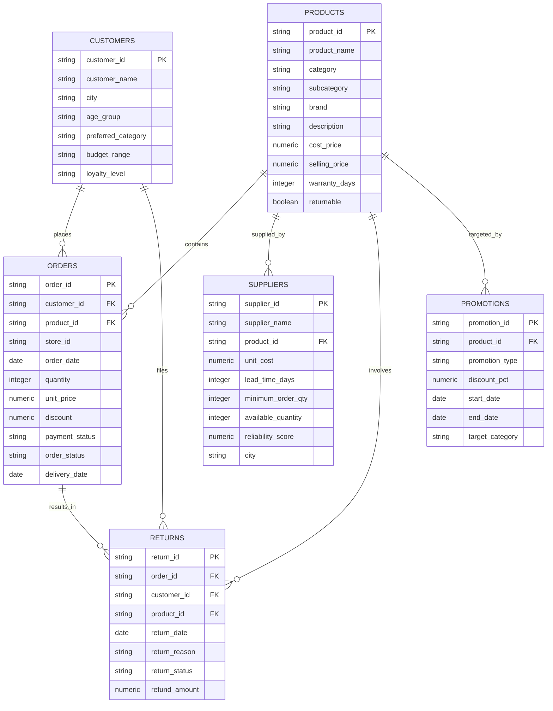

# RetailSense AI — Supporting Data Dictionary (DEMO / SYNTHETIC DATA)

> [!NOTE]
> **DEMO / SYNTHETIC DATA LABEL**
> The files located in `data/generated/` are **controlled synthetic supporting datasets** engineered to populate relational entities (Products, Suppliers, Customers, Orders, Returns, Promotions) for multi-agent autonomous decision workflows.
>
> The raw transaction dataset (`data/raw/ecommerce_transactions.csv`) is an input used by processing/seeding. Its provenance and redistribution rights were not independently verified during this audit; do not describe it as real, synthetic, or publication-safe without confirming its source.

---

## 1. Entity-Relationship Overview

---

## 2. Table Specifications

### 2.1 Table: `products.csv` (40 records)
| Column Name | Data Type | Key Type | Constraint / Description |
| :--- | :--- | :--- | :--- |
| `product_id` | `VARCHAR(50)` | Primary Key | Format: `PROD_<CAT>_<NUM>` (e.g. `PROD_BEA_001`) |
| `product_name` | `VARCHAR(255)` | None | Descriptive title of the retail catalog item |
| `category` | `VARCHAR(100)` | Domain FK | One of 8 categories (Beauty, Books, Clothing, Electronics, etc.) |
| `subcategory` | `VARCHAR(100)` | None | Specific product sub-type (e.g. Skincare, Audio) |
| `brand` | `VARCHAR(100)` | None | Brand manufacturer name |
| `description` | `TEXT` | None | Product description and features |
| `cost_price` | `NUMERIC(10,2)`| None | Base procurement cost per unit ($) |
| `selling_price` | `NUMERIC(10,2)`| None | Retail selling price per unit ($) |
| `warranty_days` | `INTEGER` | None | Warranty coverage in days (0 for non-warranted items) |
| `returnable` | `BOOLEAN` | None | True if eligible for customer return |

---

### 2.2 Table: `suppliers.csv` (62 records)
| Column Name | Data Type | Key Type | Constraint / Description |
| :--- | :--- | :--- | :--- |
| `supplier_id` | `VARCHAR(50)` | Primary Key | Format: `SUP_<NUM>` |
| `supplier_name` | `VARCHAR(255)` | None | Supplier corporate entity name |
| `product_id` | `VARCHAR(50)` | Foreign Key | References `products.product_id` |
| `unit_cost` | `NUMERIC(10,2)`| None | Wholesale supplier price per unit ($) |
| `lead_time_days` | `INTEGER` | None | Supplier lead time in days (Range: 3 – 14) |
| `minimum_order_qty`| `INTEGER` | None | Reorder Minimum Order Quantity (MOQ) |
| `available_quantity`|`INTEGER` | None | Supplier warehouse available stock |
| `reliability_score`|`NUMERIC(3,2)` | None | Fulfillment reliability rating (0.80 – 0.99) |
| `city` | `VARCHAR(100)` | None | Supplier distribution center city |

---

### 2.3 Table: `customers.csv` (100 records)
| Column Name | Data Type | Key Type | Constraint / Description |
| :--- | :--- | :--- | :--- |
| `customer_id` | `VARCHAR(50)` | Primary Key | Format: `CUST_<NUM>` |
| `customer_name` | `VARCHAR(255)` | Entity Align | Exact customer name matching primary dataset (e.g. Ava Hall) |
| `city` | `VARCHAR(100)` | None | Primary customer location city |
| `age_group` | `VARCHAR(20)` | None | Age demographic bracket (`18-29`, `30-44`, `45-59`, `60+`) |
| `preferred_category`|`VARCHAR(100)`| None | Preferred shopping category |
| `budget_range` | `VARCHAR(50)` | None | Customer purchasing tier |
| `loyalty_level` | `VARCHAR(50)` | None | Customer tier (`Bronze`, `Silver`, `Gold`, `Platinum`) |

---

### 2.4 Table: `orders.csv` (2,000 records)
| Column Name | Data Type | Key Type | Constraint / Description |
| :--- | :--- | :--- | :--- |
| `order_id` | `VARCHAR(50)` | Primary Key | Format: `ORD_<NUM>` |
| `customer_id` | `VARCHAR(50)` | Foreign Key | References `customers.customer_id` |
| `product_id` | `VARCHAR(50)` | Foreign Key | References `products.product_id` |
| `store_id` | `VARCHAR(50)` | None | Store region (`STORE_USA`, `STORE_CANADA`, etc.) |
| `order_date` | `DATE` | None | Date of order placement (`YYYY-MM-DD`) |
| `quantity` | `INTEGER` | None | Units purchased per order |
| `unit_price` | `NUMERIC(10,2)`| None | Unit price at time of order ($) |
| `discount` | `NUMERIC(10,2)`| None | Total discount applied ($) |
| `payment_status` | `VARCHAR(50)` | None | `Completed`, `Pending`, `Failed` |
| `order_status` | `VARCHAR(50)` | None | `Delivered`, `Shipped`, `Processing`, `Cancelled` |
| `delivery_date` | `DATE` | None | Date of delivery completion (Null if cancelled/pending) |

---

### 2.5 Table: `returns.csv` (59 records)
| Column Name | Data Type | Key Type | Constraint / Description |
| :--- | :--- | :--- | :--- |
| `return_id` | `VARCHAR(50)` | Primary Key | Format: `RET_<NUM>` |
| `order_id` | `VARCHAR(50)` | Foreign Key | References `orders.order_id` |
| `customer_id` | `VARCHAR(50)` | Foreign Key | References `customers.customer_id` |
| `product_id` | `VARCHAR(50)` | Foreign Key | References `products.product_id` |
| `return_date` | `DATE` | None | Date return request filed |
| `return_reason` | `VARCHAR(255)`| None | Reason (Defective Product, Wrong Size, Changed Mind, etc.) |
| `return_status` | `VARCHAR(50)` | None | `Refunded`, `Approved`, `Rejected` |
| `refund_amount` | `NUMERIC(10,2)`| None | Total refunded monetary value ($) |

---

### 2.6 Table: `promotions.csv` (50 records)
| Column Name | Data Type | Key Type | Constraint / Description |
| :--- | :--- | :--- | :--- |
| `promotion_id` | `VARCHAR(50)` | Primary Key | Format: `PROMO_<NUM>` |
| `product_id` | `VARCHAR(50)` | Foreign Key | References `products.product_id` |
| `promotion_type` | `VARCHAR(100)`| None | Campaign type (Flash Sale, Holiday Special, Clearance) |
| `discount_pct` | `NUMERIC(5,2)` | None | Discount percentage applied (%) |
| `start_date` | `DATE` | None | Campaign start date |
| `end_date` | `DATE` | None | Campaign end date |
| `target_category`|`VARCHAR(100)`| None | Product category targeted by campaign |
