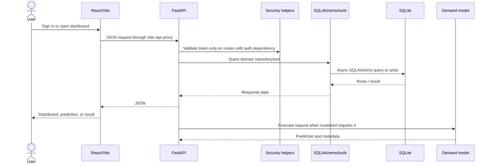

# Data Flow

## Application Request Path

Not every API route has an auth dependency. See [Security](SECURITY.md) and [API Guide](API_GUIDE.md).

## CSV Import and Export

The browser selects a `.csv`, reads it locally as text, and sends it to `POST /api/v1/data/import/preview` as multipart form data. The endpoint reads the full upload into memory, tries UTF-8 with BOM then Latin-1, returns headers, row count, and up to 20 correctly-sized sample rows. The UI maps headers to selected entity fields and submits the complete CSV text with `entity_type`, `column_mapping`, and `duplicate_strategy` to `/data/import/execute`.

The UI marks these columns as required for mapping/preview. The backend does not consistently validate them:

| Entity | UI-required columns | Other UI fields | Fields consumed by the current importer |
|---|---|---|---|
| `customers` | `customer_id`, `customer_name` | `city`, `age_group`, `preferred_category`, `budget_range`, `loyalty_level` | ID, name, city, preferred category, loyalty; age group and budget are ignored |
| `products` | `product_id`, `product_name`, `category` | `subcategory`, `brand`, `cost_price`, `selling_price` | ID, name, category, cost and selling price; other displayed columns are ignored, warranty/returnability use defaults |
| `inventory` | `product_id`, `store_id`, `current_stock` | `reorder_point`, `lead_time_days`, `safety_stock` | Product ID, store ID, current stock; new rows use a default reorder point, other displayed fields are ignored |
| `sales` | `transaction_id`, `purchase_amount` | `user_name`, `country`, `product_category`, `payment_method`, `transaction_date` | ID, amount, user, country, category; payment method and transaction date are assigned defaults |
| `suppliers` | `supplier_id`, `supplier_name`, `product_id`, `unit_cost` | `lead_time_days` | ID, name, product, unit cost; new rows use defaults for lead time, MOQ, quantity, reliability, and city |

Templates are available at `/data/template/{entity_type}`. An `orders` template exists but `orders` is not in the UI entity selector and has no import-execution branch. Admin and Retailer layouts both mount the UI wizard; the HTTP endpoints do not enforce those roles.

Import execution currently supports customers, products, inventory, sales, and suppliers. It applies entity-specific fallback values and duplicate behavior, commits the session, and returns row counters. It does not enforce the UI's displayed 50 MB limit, validate a complete required schema, consistently honor all duplicate choices, or reliably convert malformed cells into row-specific validation errors. The route does not apply an authentication dependency. The `orders` template is not an implemented import branch.

Export queries the selected supported table and responds as CSV. Customers, products, inventory, sales, and suppliers are supported; unsupported entity types receive HTTP 400. Export also lacks route-level authorization.

## Demand Data Flow

`ml/train.py` reads `data/processed/feature_dataset.csv`, one-hot encodes `product_category`, uses preassigned chronological `train`/`validation`/`test` groups, fits Linear Regression, Random Forest, and XGBoost candidates, evaluates MAE/RMSE/R2/MAPE, and persists the best model and metadata using `ModelRegistry`.

`ml/predict.py` loads that artifact and feature names, selects the latest row for a derived product category, predicts a base value, and creates each requested day by adding a deterministic sinusoidal variation. The forecast is useful as a demo inference path; it is not an independently trained multi-horizon model. `store_id` is included in the response but not used in feature selection.

## Agent Data Flow

`POST /api/v1/agents/execute` creates per-request state. The keyword classifier selects tasks; agent nodes call domain tools; tools access repositories/DB and sometimes the demand model. The response contains state, result and audit lists as JSON-safe data. It is not automatically stored as an `AgentRun` or `ToolCall` record.

The LLM client is a separate optional service. The `rag/` directory has no operational embedding, index, or retrieval code. Static source-like strings in the Orchestrator are not evidence of retrieved content.

## Dataset Provenance

Seeder inputs include generated products, suppliers, customers, orders, returns, and promotions; sales are loaded from the processed transaction file when available or the raw transaction CSV as fallback. The supporting generated data is documented as synthetic. Verify provenance and permissions for the raw transaction dataset before redistribution, screenshots, or external deployment.
