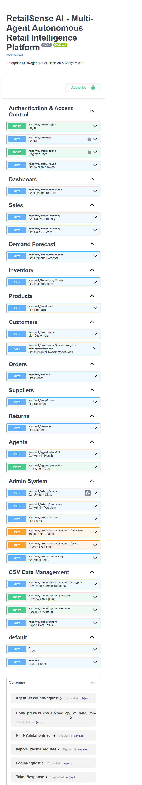

# Screenshots

The screenshots below were captured from the running local application on 2026-10-02. They show demo data, not production telemetry. No login form, password, token, or API key is included. The integrated browser constrained dashboard captures to an approximately 770 x 457 viewport, so they show only the initial screen area; replace them with wider desktop captures when available.

## Admin

The KPI values are loaded from the local API. The agent status grid and approval examples are hard-coded in the Admin layout and should be read as UI mock data, not measured health or pending live approvals. See [Dashboard guide](DASHBOARDS.md#admin).

## Retailer

Captured from the local Retailer dashboard after sign-in. The page may combine API-backed figures with presentation defaults; verify a value against its API before treating it as a report. See [Dashboard guide](DASHBOARDS.md#retailer).

## API

The screenshot shows the generated local OpenAPI interface at `/docs`; route availability does not imply that every operation is authenticated.

## Not Yet Captured

- Customer landing/catalog and recommendations
- Login page (the current form pre-populates demo credentials; clear fields and hide credential hints before capturing)
- Admin customer-management and CSV import result
- Retailer inventory and demand forecast detail
- Agent execution interface
- Architecture image (the source-of-truth diagrams are Mermaid in the docs)

Use the reproducible steps in [SCREENSHOT_GUIDE.md](SCREENSHOT_GUIDE.md). Never include real customer data, login credentials, access tokens, or API keys.
